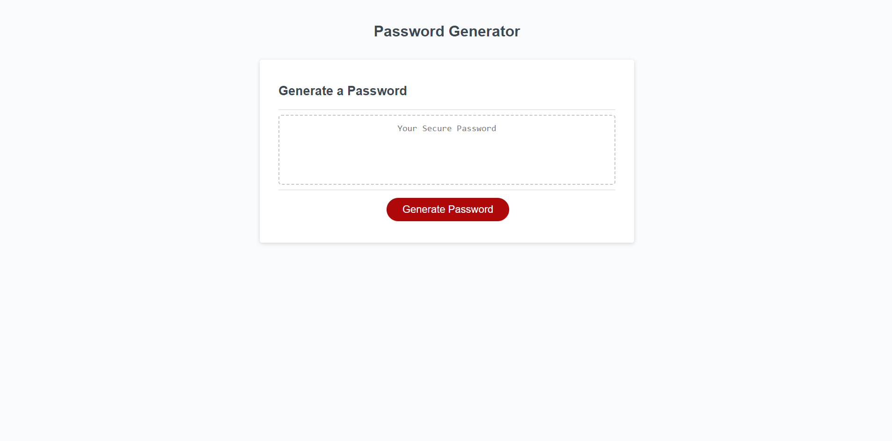

# Password Generator - Javascript

Password Generator powered by JavaScript

# User Story

AS AN employee with access to sensitive data  
I WANT to randomly generate a password that meets certain criteria  
SO THAT I can create a strong password that provides greater security  

# Acceptance Criteria

GIVEN I need a new, secure password  
WHEN I click the button to generate a password  
THEN I am presented with a series of prompts for password criteria  
WHEN prompted for password criteria  
THEN I select which criteria to include in the password  
WHEN prompted for the length of the password  
THEN I choose a length of at least 8 characters and no more than 128 characters  
WHEN asked for character types to include in the password  
THEN I confirm whether or not to include lowercase, uppercase, numeric, and/or special characters  
WHEN I answer each prompt  
THEN my input should be validated and at least one character type should be selected  
WHEN all prompts are answered  
THEN a password is generated that matches the selected criteria  
WHEN the password is generated  
THEN the password is either displayed in an alert or written to the page  

# Mock-up Image of Site

# Link to Live Site

https://thomas-barnhart.github.io/Password-Generator-JavaScript/

# Link to GitHub

https://github.com/Thomas-Barnhart/Password-Generator-JavaScript

# Final Use

This site can be used to generate a password ranging from 8 to 128 characters in lenght. Using a either lowercase, uppercase, numeric and/or special characters. User will be alerted if they go outside of the defined parameters.
